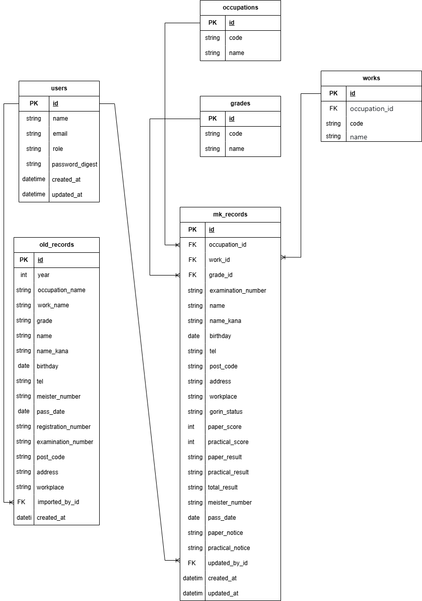

## 1. サービス概要（※最後に書いてOK）

※この章は**最初に書かなくて大丈夫**です。
下の章を書き終えたあとに戻ってきてください。

- このサービスはどんなサービスか（3行以内）
- 誰の、どんな課題を、どう解決するか

・とある試験の受験者情報をデータで一元管理し、紙資料からの検索業務をなくす業務支援アプリ。
・試験の担当職員が受験者の合格情報を即座に検索・確認できるようにする。

---

## 2. このアイデアはどこから生まれたか

### 2-1. きっかけとなった体験・感情

このアイデアの元になった
**自分自身の体験・感情・違和感**を教えてください。

- いつ
	業務課の試験を担当する職員から、過去の受験者情報を名簿(紙)から探すため、受験者情報の確認に時間がかかるの相談があった。
- どんな状況で
	受験者から過去の受験記録の問い合わせがあったとき。
- どんな気持ちになったか
	データ検索が可能になればいいなと思いました。

できるだけ具体的なエピソードで書いてください。
・受験者が上位試験や受験免除を申請するにあたり、過去の合格情報を確認することがあります。
・受験者もいつ合格したかわからず、また内部のシステムも過年度分の受験情報を一括して検索ができません。
・そのため、該当部署は、数名で紙に綴られた受験者名簿から、合格者情報を確認しており時間や工数がかかっています。

---

### 2-2. なぜそれが「気になった」のか

同じ体験をしても、気にしない人もいます。
**なぜ自分はそれが気になったのだと思いますか？**

・現状を変えたいけど、変える方法がわからない。
・みんなそれぞれ忙しいけど、誰かがやらないと何も変わらない。

---

## 3. 課題の整理（表面的になっていないか）

### 3-1. 表に見えている困りごと

その体験の中で、最初に感じた「困りごと」は何ですか？
・私自身の解決スキル(アプリ等を作成する等)が足りていないこと。

---

### 3-2. 本当に解決したい課題は何か

「なぜそれが困るのか？」を**最低3回**繰り返してください。

- なぜ？
・データがあるのに、それを活用できずたくさんの紙資料から複数名で受験履歴をさがしていること。
・試験の受付時には、過去の受験履歴が分からない受験者1名に対し、1〜3名の職員で、5分〜15分ほどかけて受験履歴を探している。

- なぜ？
・探している間お客様も待たせ、職員も数名がかかりで工数がかかる。

- なぜ？
・慢性的に業務が忙しい上、紙で情報を探している間、他の業務ができず仕事が滞る。

→ 本当に解決したい課題：過年度分を横断した受験者情報の検索

---

## 4. 想定ユーザーについて

### 4-1. 想定しているユーザー

・業務課の試験を担当する職員

---

### 4-2. 自分とユーザーの距離

以下のうち、最も近いものを選んでください。

- 身近な誰か

→ なぜその距離感なのか理由を書いてください。
・業務課の試験を担当する職員が困っているため。

### 4-3. 実際に使われる可能性について(需要・存在確認)

このアプリは、「実際に使う人がいそうか？」という視点で見たとき、どうでしょうか。

- まず最初に使ってくれそうな人は誰か？
・業務課の試験を担当する職員

- その人は、どんな場面でこのアプリを思い出すか？
・受験者から問い合わせがあった場合
・試験に関わる団体の会議資料(受験者の推移等)として

- 今の生活の中で、代わりに使っているものは何か？
・紙情報

- それを置き換えてまで使う理由はあるか？
・業務の効率化

※フィードバックをもらって改善することが大事です

## 4-4. ユーザーがサービスを導入して利用するまでのイメージ(導入・継続の流れ)

・業務課の試験を担当する職員

## 5. 既存サービス・競合調査

### 5-1. 似たサービスの調査

「受験管理システム」「試験管理 クラウド」「検定受付 SaaS」などで調査を行いました。
汎用的な試験・資格管理サービスは存在しますが、以下の理由から導入は難しいと判断しました。
・既存の基幹システムが存在しており、完全移行ができません。
・試験は職種・作業ごとに、学科や実技など細かく区分されており、汎用サービスではこの構造に対応したデータ管理・検索が困難です。
・試験に関わる団体へのフィードバック、職種や作業別の材料代や試験員の管理(所属団体、謝金等)、実績に応じた表彰制度など、実装可否もありますが、業務固有の発展的な機能追加に柔軟に対応することが汎用的なシステムでは困難です。

---

### 5-2. それでも自分が作りたい理由

・外注だと高額になり予算がありません。
・既存システムを補完する形で、過去の受験履歴を横断検索できる機能に特化したツールが必要なためです。

### 5-3. 差別化を一文で決める
このアプリは、【どんな人】の【どんな瞬間】を一番助けるアプリですか？
- 私のアプリの差別化ポイント：

・業務効率化が図れる。

---

## 6. このサービスで提供したい価値

### 6-1. ユーザーの変化

このサービスを使うことで、ユーザーはどう変化しますか？

例:
- 行動の変化：紙からデータ検索
- 気持ちの変化：業務効率化
- 考え方の変化：複数年度で情報の可視化ができる。

### 6-2. 価値を一文で表す

「このサービスは、試験の運営担当者が、受験者の合格情報を素早く検索・確認できるようになるサービス」

---

## 7. このアプリで実現すること

### MVPで作る機能
・CSVからデータを取込む機能
・検索機能

### 本リリースで作る機能

・受験履歴を横断検索できる機能

## 8. このアプリの懸念点とその対策
※最低1つは必ず書いてください。

このアプリが**うまくいかない可能性**と、
それに対して**どう向き合おうとしているか**を書いてください。

### 懸念点①

- 何が問題になりそうか：個人情報（受験者データ）の取り扱いとセキュリティ
- なぜそう思うか：個人情報を扱うため
- そのために考えている対策：初心者のため高度な実装は難しい部分もありますが、以下を中心に対応予定です。
・sorceryによる認証・ログイン機能の実装
・RailsデフォルトのCSRF対策
・ActiveRecordを使用したSQLインジェクション対策
・環境変数による機密情報の管理（master.key、APIキー等）
・Render(公開の場合)でのHTTPS通信

## 9. 今後の展開・発展の方向性

このアプリは、
**「投稿して終わり」にならないために**
どんな広がりが考えられますか？

### 観点（すべて答えなくてOK）

- ユーザーはなぜ使い続ける？
　紙よりデータで検索した方が業務効率化が図れるため。

- 続けることで何が変わる？
	データが蓄積できる。

- データが溜まると何ができる？
	受験者の傾向(A試験を受けるひとはB試験も受験する可能性が高い)が把握できる

- 他の人と関わる余地はある？
	受験資格に関連する団体

- 運用・仕組みで価値を出せないか？

### 今考えている発展案

- 機能追加の方向性：試験毎の材料代や試験委員の謝金を管理等
- UI・体験の改善：PCに不慣れな人も多いため、シンプルな構成
- 機能以外の工夫：レスポンシブ対応

## 10. 技術スタック（手段としての技術）

### 10-1. 使用予定の技術
- Ruby：3.2.2
- Rails：7.1.3
- MySQL2：0.5.6
- ransack：4.1.1
- sorcery：0.17.0
※バージョンは現在確認中のため、確定次第更新いたします。

---

### 10-2. 技術選定の理由

- なぜこの技術を使うのか：
　・ransack：管理画面での多条件検索に適しているため。
　・sorcery：軽量な認証実装に向いているため。
- 今回チャレンジしたい点：イチから環境構築。
- 不安な点：現時点では全てです。

---

### 画面遷移図
Figma：<https://www.figma.com/design/moU3rDFI2HKPnsWLdcj1sW/Kentei?node-id=0-1&t=NBhF0J3OzKWbkt8O-1>

### ER図
